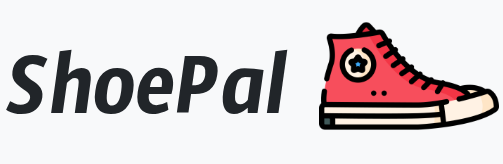

# ShoePal 👟

La seguente repository contiene il progetto sviluppato nell'ambito del corso di Basi Di Dati del professore Valerio Bellandi nell'anno accademico 24/25

Il progetto realizzato in HTML, PHP, SQL e CSS gestisce un database ed un applicativo per accedervi

Il progetto è diviso in due sezioni, una per i manager ed una per i clienti

## Clienti

Tramite la loro interfaccia utente i clienti possono:
- Acquistare prodotti
- Richiedere tessere fedeltà per guadagnare punti
- Spendere i punti guadagnati per ottenere sconti

## Managers

I manager invece dalla loro interfaccia possno gestire tutto:
- Aprire e chiudere o creare negozi, prodotti, fornitori
- Gestire le disponibilità dei prodotti e spostarli tra i vari negozi
- Visualizzare gli ordini passati ed effettuare rifornimenti presso i fornitori
- Gestire i clienti e le loro tessere
- Visualizzare statistiche di vendita e varie sulla gestione dei negozi

In questa repository sono presenti i seguenti materiali:

## Materiali

- La cartella `ShoePal` contiene il progetto vero e proprio:
    - `assets` contiene le immagini usate nel progetto
    - `conf` contiene il file di configurazione del db. Nota: per poter utilizzare il progetto occorre modificare il file qui contenuto con le proprie credenziali di accesso al database
    - `css` contiene un file css semplicemente usato per il font personalizzato del logo
    - `lib` contiene tutti i file di utilità del progetto, come i footer o navigation delle pagine, oltre alla maggior parte delle funzioni utilizzate nelle pagine
    - il resto dei file PHP contenuti sono le pagine del progetto
- `BDLAB_progetto2425.pdf` è la traccia ufficiale del progetto
- `DocumentazioneTecnica.pdf` è la relazione del progetto contenente dettagli sulla progettazione funzionalità e specifiche tecniche
- `ManualeUtente.pdf` è il manuale d'uso del progetto e contiene le specifiche necessarie, due account già predisposti per l'accesso e dettagli sull'installazione ed uso
- `shoepal.sql` è il dump della base di dati: contiene la base di dati e molte funzionalità e trigger utilizzati dal progetto

## Accedere al progetto

Per poter utilizzare il progetto nel suo insieme occorre utilizzare questa repository ed installarla come specificato in `ManualeUtente.pdf`. Se invece si vuole solo utilizzre l'applicativo oltre alla possibilità di installazione è anche possibile farlo [al seguente link](https://studenti.di.unimi.it/francescoemanuele.corrado@studenti.unimi.it/ShoePal/login.php)

*Francesco Corrado 2025*